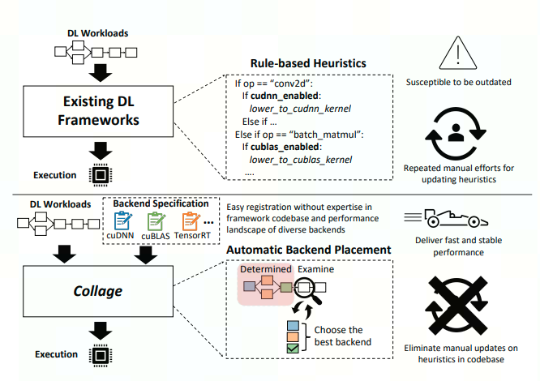

Introduction
============

# Collage

The strong demand for efficient and performant deployment of
Deep Learning (DL) applications prompts the rapid development of
a rich DL ecosystem. To keep up with this fast advancement, it is crucial for modern DL frameworks to efficiently integrate a variety of
optimized tensor algebra libraries and runtimes as their backends
and generate the fastest possible executable using these backends.
However, current DL frameworks require significant manual effort and expertise to integrate every new backend while failing
to unleash its full potential. Given the fast-evolving nature of the
DL ecosystem, this manual approach often slows down continuous
innovations across different layers; it prevents hardware vendors
from the fast deployment of their cutting-edge libraries, DL framework developers must repeatedly adjust their hand-coded rules
to accommodate new versions of libraries, and machine learning
practitioners need to wait for the integration of new technologies
and often encounter unsatisfactory performance.


## Motivation

This tuning approach contrasts with TVM's existing "greedy" and "manual" approaches to partitioning:

Greedy: Currently only the largest possible supported sub-graphs are used for partitions, irrespective of their execution time. With Collage many more candidate sub-graphs are explored, and it is possible for two smaller sub-graphs to yield better overall latency than one large sub-graph if they mix toolchains.
Manual: Currently the TVM user must commit to a BYOC toolchain and invoke the corresponding partition_for_<toolchain> function before the main TVM compilation flow begins. With Collage the choice of toolchain can be automated based on measured latency. Collage will also explore mixing and matching between multiple BYOC toolchains as well as TVM's native backend.

Collage offers three advantages:

* Latency: Overall model latency may be reduced compared to TVM native, TVM with a single partition_for_<toolchain> call, or a non-TVM stand-alone compiler such as TensorRT.
* Automation: The choice of which BYOC toolchains to enable can be automated.
* Economy and modularity of implementation: Four standalone passes using two separate mechanisms for expressing partitioning rules/algorithms can be replaced with one, which itself is built from compositional primitives. (The machinery is also reusable for the very similar problem of choosing TVM fusion kernels, which we'll tackle in the future).

## Success Metrics

Collage offers at least a 10% latency improvement for a selection of standard ONNX models and NVIDIA hardware using targets which include the CuDNN and CuBlas libraries, the CUTLASS library (with tuning, via BYOC), the TensorRT compiler (via BYOC), and (obviously!) TVM native.
Collage does not require new per-target or per-model patterns or rules to be implemented independently of the BYOC integrations.
Collage with a Target list enabling just one BYOC toolchain is never worse than using the the existing partition_for_<toolchain> function directly. (Since partitioning for multiple toolchains in sequence should never improve the result for any single toolchain we consider just the single BYOC case.)

## Guide-level explanation
Collage allows the choice and partitioning for BYOC toolchains to be determined automatically so as to minimize overall (expected) model execution latency.

To compile with Collage it's necessary to set a PassContext flag, and include 'Collage aware' Targets in the build's target argument.

For example, assume mod is bound to MNIST:

```dotnetcli
def @main(%x: Tensor[(1, 1, 28, 28), float32]) -> Tensor[(1, 10), float32] {
  %0 = nn.pad(%x, 0f, pad_width=[[0, 0], [0, 0], [2, 2], [2, 2]]);
  %1 = nn.conv2d(%0, meta[relay.Constant][0] /*Tensor[(8, 1, 5, 5), float32]*/,
                 padding=[0, 0, 0, 0], channels=8, kernel_size=[5, 5]);
  %2 = add(%1, meta[relay.Constant][1] /*Tensor[(8, 1, 1), float32]*/);
  %3 = nn.relu(%2);
  %4 = nn.max_pool2d(%3, pool_size=[2, 2], strides=[2, 2], padding=[0, 0, 0, 0]);
  %5 = nn.pad(%4, 0f, pad_width=[[0, 0], [0, 0], [2, 2], [2, 2]]);
  %6 = nn.conv2d(%5, meta[relay.Constant][2] /*Tensor[(16, 8, 5, 5), float32]*/,
                 padding=[0, 0, 0, 0], channels=16, kernel_size=[5, 5]);
  %7 = add(%6, meta[relay.Constant][3] /*Tensor[(16, 1, 1), float32]*/);
  %8 = nn.relu(%7);
  %9 = nn.max_pool2d(%8, pool_size=[3, 3], strides=[3, 3], padding=[0, 0, 0, 0]);
  %10 = reshape(%9, newshape=[1, 256]);
  %11 = nn.dense(%10, meta[relay.Constant][4] /*Tensor[(10, 256), float32]*/, units=None, out_dtype="float32");
  add(%11, meta[relay.Constant][5] /*Tensor[(1, 10), float32]*/)
}
```
We can compile this with Collage enabled for a variety of NVIDIA toolchains/libraries with the following fragment:
```dotnetcli
with tvm.transform.PassContext(config={"relay.fallback_device_type": 2, "relay.collage.enable_collage": True}):
    host_target = tvm.target.Target("llvm")
    generic_target = tvm.target.Target("cuda", host_target)
    cutlass_target = tvm.target.Target("cuda -compiler=cutlass", host_target)
    tensorrt_target = tvm.target.Target("cuda -compiler=tensorrt", host_target)
    cudnn_target = tvm.target.Target("cuda -compiler=cudnn", host_target)
    cublas_target = tvm.target.Target("cuda -compiler=cublas", host_target)
    targets = [generic_target, cutlass_target, tensorrt_target, cudnn_target, cublas_target]
    exe = tvm.relay.vm.compile(mod, target=targets)
```

After the CollagePartitioner pass, the intermediate "main" global function could resemble the following (though we've modified this "optimal" partitioning by hand for illustration so don't take it as representative of actual performance):

```dotnetcli
def @main(%x: Tensor[(1, 1, 28, 28), float32]) -> Tensor[(1, 10), float32] {
  # Operators left behind in the function body are intended for TVM.
  # The usual Relay passes may rewrite them, then FuseOps will push them
  # into "Primitive" functions (without any "Compiler" attribute) ready
  # for TVM lowering.
  %4 = nn.pad(%x, 0f, pad_width=[[0, 0], [0, 0], [2, 2], [2, 2]]);
  # This conv2d will be offloaded to cudnn. However the main TVM compilation
  # flow is responsible for emitting the call.
  %6 = fn (%FunctionVar_5: Tensor[(1, 1, 32, 32), float32],
           Composite="cudnn.conv2d") -> Tensor[(1, 8, 28, 28), float32] {
    nn.conv2d(%FunctionVar_5, meta[relay.Constant][0] /*Tensor[(8, 1, 5, 5), float32]*/,
              padding=[0, 0, 0, 0], channels=8, kernel_size=[5, 5])
  };
  # Back to vanilla TVM.
  %7 = %6(%4);
  %3 = add(%7, meta[relay.Constant][1] /*Tensor[(8, 1, 1), float32]*/);
  %9 = nn.relu(%3);
  %11 = nn.max_pool2d(%9, pool_size=[2, 2], strides=[2, 2], padding=[0, 0, 0, 0]);
  %13 = nn.pad(%11, 0f, pad_width=[[0, 0], [0, 0], [2, 2], [2, 2]]);
  # Use TensorRT. The "Primitive" function deleniates the partition.
  %14 = fn (%FunctionVar_03: Tensor[(1, 8, 18, 18), float32],
            %FunctionVar_11: Tensor[(16, 1, 1), float32],
            Primitive=1,
            Compiler="tensorrt",
            global_symbol="collage_nn_conv2d_add_nn_relu_1") -> Tensor[(1, 16, 14, 14), float32] {
    %1 = nn.conv2d(%FunctionVar_03, meta[relay.Constant][2] /*Tensor[(16, 8, 5, 5), float32]*/,
                   padding=[0, 0, 0, 0], channels=16, kernel_size=[5, 5]);
    %2 = add(%1, %FunctionVar_11);
    nn.relu(%2)
  };
  %15 = %14(%13, meta[relay.Constant][3] /*Tensor[(16, 1, 1), float32]*/);
  # Back to vanilla TVM.
  %17 = nn.max_pool2d(%15, pool_size=[3, 3], strides=[3, 3], padding=[0, 0, 0, 0]);
  %19 = reshape(%17, newshape=[1, 256]);
  # Use CUTLASS. Note the double function nesting: the outer "Primitive" function
  # deleniates the partition and the inner "Composite" function maps the original
  # Relay operators to a tag to be used during compilation/build/lowering with the
  # CUTLASS BYOC integration.
  %20 = fn (%FunctionVar_0: Tensor[(1, 256), float32],
            %FunctionVar_1: Tensor[(10, 256), float32],
            %FunctionVar_2: Tensor[(1, 10), float32],
            Primitive=1,
            Compiler="cutlass",
            global_symbol="collage_cutlass_dense_bias_nn_dense_add") -> Tensor[(1, 10), float32] {
    %1 = fn (%FunctionVar_01: Tensor[(1, 256), float32],
             %FunctionVar_11: Tensor[(10, 256), float32],
             %FunctionVar_21: Tensor[(1, 10), float32],
             Composite="cutlass.dense_bias") -> Tensor[(1, 10), float32] {
      %0 = nn.dense(%FunctionVar_01, %FunctionVar_11, units=None, out_dtype="float32");
      add(%0, %FunctionVar_21)
    };
    %1(%FunctionVar_0, %FunctionVar_1, %FunctionVar_2)
  };
  %20(%19, meta[relay.Constant][4] /*Tensor[(10, 256), float32]*/,
      meta[relay.Constant][5] /*Tensor[(1, 10), float32]*/)
}
```

## Reference-level explanation
If the relay.collage.enable_collage PassConfig attribute is true then a new CollagePartitioner pass is inserted before all other Relay passes. The result of the pass is:

All Relay sub-graphs in all global functions which are to be handed off to a BYOC toolchain are replaced by calls to an inline "Primitive" function with "Compiler" and "global_symbol" attributes.
Relay operators, or groups of operators, which are to be translated to particular library or BYOC-supplied function are replaced by calls to an inline "Composite" function. (This encoding is supported for both BYOC and external libraries.)
TODO(mbs): We need to also support RFC10 style BYOC extensions in the partitioning encoding.

Note that no "Primitive" functions denoting TVM kernels are produced -- the existing FuseOps pass is still required.

The CollagePartitioner pass has four phases:

* Phase 1: The available Targets are scanned to build a list of rules describing how to find possible partitions ( see PartitionSpec and PartitionRule below). Depending on the Target the rules may incorporate entries from the BYOC pattern table. (The remaining phases execute on each global function separately.)

* Phase 2: A dataflow graph is constructed for the global function (which is just an IndexedGraph<Expr>). The available rules from phase 1 are evaluated on the dataflow graph to yield a (possibly overlapping) set of candidate partitions for each target (see CandidatePartition below). Each candidate efficiently describes a sub-graph of the global function's body without the need to construct any new expressions (see SubGraph below).

* Phase 3: A least cost path is found in the following (implicit and lazily constructed) search graph:

  1. Search Node: Each node represents the set of 'covered' dataflow nodes which have been assigned to a candidate partition on every path to the node from the starting node.
  2. Starting node: The search node with empty 'covered' set.
  3.Ending node: The search node with every dataflow node in the 'covered' set.
  4. Search Edge X->Y: A candidate partition P does not overlap X's 'covered' nodes. Y's 'covered' nodes are those of X union P. To avoid an unnecessary search space explosion the candidate must also include the next yet-to-be-covered dataflow node in X.
  5. Edge cost: The estimated latency of the candidate partition, plus a partition transition penalty. Note that though we need to be able to extract the candidate's sub-graph in order to build a function representing the candidate to measure with, we do not yet need to partition the overall function body expression.

    Other search algorithms are certainly possible, eg the paper uses an evolutionary search to refine the partitioning found by the dynamic-programming search. We can easily abstract away the search interface to support multiple implementations in the future.

* Phase 4: The function body is partitioned according to the candidate kernels on the shortest path. This phase can be run independently of the first three so that additional inspection or optimization may be applied to the intmediate optimal partitioning.

In the following we introduce the new datatypes, then expand on the phases.
Reference
=========

1. [Collage: Seamless Integration of Deep Learning Backends with Automatic Placement](https://arxiv.org/abs/2111.00655) by Byungsoo Jeon et al., PACT 2022
