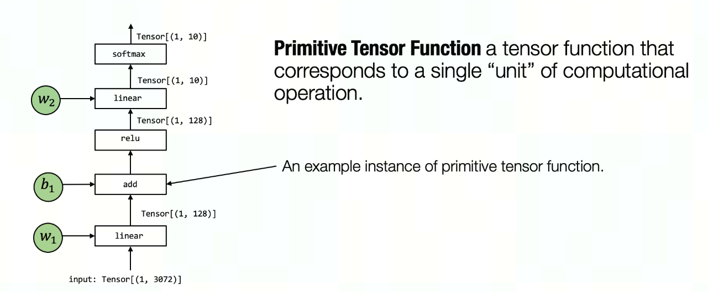

Introduction
============
In the above figure, the tensor operator linear, add, relu, and softmax are all primitive tensor functions. Notably, many different abstractions can represent (and implement) the same primitive tensor function add (as shown in the figure below). We can choose to call into pre-built framework libraries(e.g. torch.add or numpy.add), and leverage an implementation in python. In practice, primitive functions are implemented in low-level languages such as C/C++ with sometimes a mixture of assembly code.



TVMScript
=========
TVMScript, as a roundtrippable python-based text format, is
the central piece of TVM performance productivity. As the frontend of TVM, it
enables end users to directly construct the TVM IR, either TIR or Relax, in a
pragmatic approach. From Relax to MetaSchedule and TIR, TVMScript enables
inspectability and reproducibility at any level of compilation and
optimization. Furthermore, based on TVMScript, developers are empowered to
intercept, manipulate and customize the compiler behavior in a principled way.

```
class Module:
    def mmult(A: ty.handle, B: ty.handle, C: ty.handle) -> None:
        # function attr dict
        tir.func_attr({"global_symbol": "mmult", "tir.noalias": True})
        A_1 = tir.buffer_bind(A, [1024, 1024], elem_offset=0, align=128, offset_factor=1)
        B_1 = tir.buffer_bind(B, [1024, 1024], elem_offset=0, align=128, offset_factor=1)
        C_1 = tir.buffer_bind(C, [1024, 1024], elem_offset=0, align=128, offset_factor=1)
        # body
        tir.attr(C_1, "realize_scope", "")
        tir.realize(C_1[0:1024, 0:1024])
        for x in tir.range(0, 1024):
            for y in tir.range(0, 1024):
                C_1[x, y] = tir.float32(0)
                for k in tir.range(0, 1024):
                    C_1[x, y] = (C_1[x, y] + (A_1[x, k]*B_1[k, y]))
```

Tensor IR
=========

## BackGround and Motivation

TVM is an end-to-end deep learning compiler with two levels of IR and optimization. TVM translates popular DL frameworks into Relay and optimizes the computation graph, after which it lowers each graph node into Tensor Expression(TE) and does another function-level optimization before finally lowering it into TIR and generating backend code. In brief, the current workflow is

``TF/PyTorch/ONNX -> Relay -> TE (based on TE schedule) -> TIR -> C++/CUDA``

Currently, low-level optimization is done through TE scheduling, which has several limitations:

* Based on an accessory data structure: schedule tree. Schedule primitives operate on schedule tree rather than TIR itself directly, which makes the scheduling result less intuitive.
* All primitives are coupled on the schedule tree representation, it is not easy to add new primitives and ensure the correctness of transformation at the same time.
* Limited high-dimension instruction and tensorization support. TE is not schedulable after tensorization. The description of tensor intrinsics is not friendly to users.


## Introduction

TensorIR is a brand new low-level IR with full scheduling support. Here are some key features and novel techniques.

### Core data structure: Block and Block Realize
To generalize the high-dimension tensor expression, we introduce a new statement structure Block. A block can wrap any part of the IR to provide isolation. A block is the minimal unit for scheduling and tensorization, which stores all the fundamental information of computation including block iteration vars, the region that the block reads and writes, the buffer which allocated inside the block, and the critical body statement. Block declare the expression computation with its iteration vars and types.

### Key Features: Independent scheduling based on IR itself
Different from the TE schedule, TensorIR has a complete set of schedule algorithms, which does not need a schedule tree or any extra data structure. We will introduce a brand new set of schedule primitives and it has full backward compatibility for the TE schedule. We simplify the compiling workload and conception.

```TF/PyTorch/ONNX -> Relay -> TIR -> schedule -> TIR -> scheudle -> TIR -> C++/CUDA```

### Stronger Expressiveness and Optimization Ability

One of the improved tasks is concatenating:

## TE
```
B = te.compute(i, tvm.tir.if_then_else(i < 10, A0[i], tvm.tir.if_then_else(i < 20, A1[i - 10], A2[i - 20])
```

## TensorIR:
```
with tir.block([10]) as vi:
    B[vi] = A0[vi]
with tir.block([10]) as vi:
    B[vi + 10] = A1[vi]
with tir.block([10]) as vi:
    B[vi + 20] = A2[vi]
```
The critical improvement is performance. In TIR we optimize the program by deprecating the if branch, which is impossible in the TE schedule.

### Memory and Execution Scope

Hardware accelerators led by GPUs are increasingly using hierarchical architecture, including memory hierarchy(global, shared, local/wmma in NV-GPU) and execution hierarchy(SM, warp, thread in NV-GPU). TVM defines the memory hierarchy and TensorIR provides corresponding native hierarchical block and execution scope. Different execution scope can access different memory scope.

TensorIR natively supports hierarchy checks. We will check the memory access and thread binding, including warp level instruction(wmma) validation during the schedule. Following is an example of the GPU hierarchy.

```
for bx in range(0, 32, annotation = {"loop_type":"blockIdx.x"}):
    with block(exec_scope="gpu_block"):
        for ty in range(0, 32, annotation = {"loop_type":"threadIdx.y"}):
            with block(exec_scope="gpu_warp"):
                for ty in range(0, 32, annotation = {"loop_type":"threadIdx.x"}):
                    with block(exec_scope="gpu_thread"):
                        A[i] = B[i] + 1
```

### High-dimension Scheduling and Tensorization

With more and more backend provides tensor operator and instruction, the limitation of the TE schedule shows off. It is hard to tensorize a complex stage. TensorIR chooses a block (a wrap of high-dimension computation) as the minimum schedule unit. We can natively tensorize a sub-program and even do schedule after tensorization.

### Decouple Primitives and Correctness Proof

Since every primitive directly rewrite the AST (it works like a StmtMutator), we easily decouple primitives. Developers can add a schedule primitive as easy as add a pass. Also, it is easy to ensure the program has the same behavior between origin one and scheduled one by proving the correctness of each primitive and checking intermedia IR during the schedule.

### Round-trip Python Hybrid Syntax

Tir script enables developers to write TensorIR through python syntax, one of the most popular languages. Also, it provides a way to store the IR after or during the schedule.


![Automatic optimization for tensorized program with hardware intrinsics. We take 64x64x64 matrix multiplication
followed by a RELU operator as the input workload and 4x4x4 matmul as the synthetic tensor intrinsic which is implemented
by a dot product instruction. The tensorization candidate generation step tiles the 64x64x64 GEMM into 4x4x4 sub-tiles and
isolate the sub-computation. Then the tensorized program sketch generation step schedules the computation and insert the
resulting data movement (AutoCopy) blocks which are scheduled independently. Finally, we use evolutionary search to fill
the random decisions in sketches with a validation mechanism to filter out incorrect programs.](./image/optimization.png)

Meta Schedule
=============

Meta schedule provides a pragmatic way to define the space of automatic tuning, extensibility in terms of all possible TIR schedule primitives like tensorization and loop partitioning, and customizability on every layer of the automation system.

## BackGround and Motivation

### Scheduling.

In TVM, computation of each operator is described by either Tensor Expression (TE, the prior standard) or TensorIR (TIR). Through a process known as scheduling, TVM allows a pre-defined set of transformations over these IRs, either lazily (transforms by manipulating the schedule tree) or eagerly (transforms by manipulating TIR), so that the end IRs could be lowered to code with potentially better performance. Such transformations are guided by a developer-provided program, which consist of this pre-defined set of transformations, called schedule primitives.

### Design space.

The set of all possible schedulings of a TE/TensorIR is called its design space. Optimization in TVM is essentially exploring such space to find out a scheduling that transforms the IR to generate the kernel with optimal performance.

### Problems with the current scheduling system

Currently there are 3 sets of scheduling APIs in TVM:

* Manual schedule: Developers optimize their programs by manually invoking schedule primitives, i.e. explore points in the design space with humans in the loop. This can be a tedious and error-prone approach, hence the creation of AutoTVM and AutoScheduler.

* AutoTVM: The automation system requires users to define the design space through per-operator "schedule templates." Therefore, programmer time is a bottleneck in scaling to hundreds of operators across many hardware platforms. hardware platforms.

* AutoScheduler: It automatically generates schedule templates as the design space, according to a set of predefined "search rules". However, it is non-trivial to extend AutoScheduler to new schedule primitives (tensorize, loop partition, software pipelining, etc).
The three systems above have isolated sets of APIs with several layers of their own abstraction, which are not only hard to learn, but also engineering-intensive to customize.

## Benefits of Meta Schedule

The existing three scheduling systems are mutually incompatible with each other in terms of API design and divergence: besides manual TE scheduling, AutoTVM requires users to learn a new set of APIs, and AutoScheduler brings in another set of C++-based search rules. It adds the users' mental overhead to understand and extend the existing systems. Further, the inability to switch between template-based and template-free auto-tuning could lead to inferior customizability and hence make it needlessly difficult to achieve optimal performance.

Meta schedule provides:

* Succinct syntax, consistent APIs to TensorIR schedule with no other layer of abstraction.

* Unified APIs for implementing manual schedules, AutoTVM-style schedules, and AutoScheduler-style schedules.

* Extensibility of all the schedule primitives, including tensorization and loop partitioning. Almost no extra effort is needed to use a new primitive in auto-tuning.

* The automation infrastructure is extensible on every of its components. Every component of the system can be customized easily in pure python or C++ or both. For example, one can develop a new design space generator in python, a new ProgramRunner in python, etc.

## Guide-level explanation

Meta Schedule DSL is a language that provides TVM backend developers a flexible way to define or auto-generate the operator design space.

This section introduces the syntax of Meta Schedule DSL by describing the 5 common usage patterns envisioned by this RFC. These patterns are:

1. Manually constructing a schedule using existing schedule primitives (Section 3.1);
2. Defining composite schedule to simplify the ap sequence of schedule primitives (Section 3.2);
3. Describing a design space of possible schedules, a.k.a. AutoTVM-style schedule templates (Section 3.3);
4. Automatically generating the design space, a.k.a. AutoScheduler-style search rules (Section 3.4);
5. Mixing the usage of manual schedule, AutoTVM and AutoScheduler-style design space specification in Meta Schedule (Section 3.5).

### 3.1. Manual Schedule

Meta schedule APIs are almost the same as TE or TensorIR scheduling. Here is an example of a manual schedule for matrix multiplication:

```
# Designate a set of tile sizes
i_tiles = [16, 8, 8, 8]
j_tiles = [16, 8, 8, 8]
k_tiles = [256, 8]

# Tile the loops according to the tile sizes
i_0, i_1, i_2, i_3 = sch.split(loop=i, factors=i_tiles)
j_0, j_1, j_2, j_3 = sch.split(loop=j, factors=j_tiles)
k_0, k_1           = sch.split(loop=k, factors=k_tiles)

# Organize the loops into "SSRSRS" 6-level tiles
sch.reorder(
    i_0, j_0, # S: the 1st spatial tile
    i_1, j_1, # S: the 2nd spatial tile
    k_0,      # R: the 1st reduction tile
    i_2, j_2, # S: the 3rd spatial tile
    k_1,      # R: the 2nd reduction tile
    i_3, j_3, # S: the 4th spatial tile
)
```
In this manual scheduling example, the developers tweak the tile sizes and measure the performance of the generated kernels to explore the opportunities of potential optimization.

Generally speaking, while writing a schedule, there are often some parameters that are hard to determine ahead of time, for example, tile sizes, unroll steps, or which tensor intrinsics to use. Developers may manually enumerate possible combinations of these unknown factors, and then pick the best schedule according to measurement results on their device.

### 3.2. Composite Schedule Rules
As introduced in the previous section, in TensorIR, each schedule primitive handles only a very basic transformation of the IR. For example, split only splits a loop into two new loops. In the real world, the over-fine granularity of those primitives usually leads to repetitive and verbose scheduling code. Take the code snippet in the previous section as an example: a sequence of splits are invoked, followed by a reorder. Taken together these 4 primitives are colloquially known as "SSRSRS" tiling.

To make it more convenient and modular, users are allowed to register composite schedules that apply a sequence of schedule primitives according to certain analysis of the IR. The word composite here means the schedule transformation is composed of those primitives.

For example, suppose there is a composite schedule called Inline-Elementwise-Operation, which inlines elementwise computation into their consumers if possible. Applying it to the following TensorIR:
```
@tvm.script.tir
def example_func(...):
  for i, j in ...:
    with tir.Block("B") ...:
      B[i, j] = A[i, j] + 1
  for i, j in ...:
    with tir.Block("C") ...:
      C[i, j] = B[i, j] + 1
  for i, j in ...:
    with tir.Block("D") ...:
      D[i, j] = C[i, j] + 1

sch = tir.Schedule(example_func)
# `InlineElementwiseOperation` is a composite schedule rule that analyzes a given block.
# If the block contains only elementwise computation, and can be inlined into its consumer,
# then `sch.compute_inline` is called on that block.
inliner = InlineElementwiseOperation()
inliner.apply(schedule=sch, block=sch.get_block("B"))
inliner.apply(schedule=sch, block=sch.get_block("C"))
inliner.apply(schedule=sch, block=sch.get_block("D"))
```

Below is the result after applying this composite schedule, and its corresponding trace:
```
>>> print(tvm.script.asscript(sch.mod))
@tvm.script.tir
def example_func(...):
  for i, j in ...:
    with tir.Block("D") ...:
      D[i, j] = A[i, j] + 1 + 1 + 1

>>> print(sch.trace)
# Block "B" is elementwise and inlinable, then `sch.compute_inline(B)` is called
B = sch.get_block("B")
sch.compute_inline(B)
# Block "C" is elementwise and inlinable, then `sch.compute_inline(C)` is called
C = sch.get_block("C")
sch.compute_inline(C)
# Block "D" is elementwise but does not have a consumer,
# so the rule does not call `compute_inline` because it is not inlinable
D = sch.get_block("D")
```

### 3.3. AutoTVM-style Design Space Description

Meta schedule extends the schedule DSL with a set of new schedule primitives called sampling instructions. These primitives do not transform the TensorIR, but instead introduce random statistical variables which can be referenced later in scheduling to parameterize the schedule. Incorporating sampling instructions into a operator's schedule allows the backend developers to succinctly describe a design space in terms of tiling strategies, fusion levels, unroll lengths, etc.

The matmul example above is extended to cover all possible tilings using these sampling instructions:
```
# Sample tile sizes
i_tiles = sch.sample_perfect_tile(i, n=4)  # was: i_tiles = [16, 8, 8, 8]
j_tiles = sch.sample_perfect_tile(j, n=4)  # was: j_tiles = [16, 8, 8, 8]
k_tiles = sch.sample_perfect_tile(k, n=2)  # was: k_tiles = [256, 8]
# Tile the loops according to the random variables
i_0, i_1, i_2, i_3 = sch.split(loop=i, factors=i_tiles)
j_0, j_1, j_2, j_3 = sch.split(loop=j, factors=j_tiles)
k_0, k_1           = sch.split(loop=k, factors=k_tiles)
# Organize the loops into "SSRSRS" 6-level tiles
sch.reorder(
    i_0, j_0, # S: the 1st spatial tile
    i_1, j_1, # S: the 2nd spatial tile
    k_0,      # R: the 1st reduction tile
    i_2, j_2, # S: the 3rd spatial tile
    k_1,      # R: the 2nd reduction tile
    i_3, j_3, # S: the 4th spatial tile
)
```

### 3.4. AutoScheduler-style Design Space Generation
To generate design space, AutoScheduler applies a set of rules to each TE stage that corresponds to a TE operation, defined by ``te.compute(...)``. The rules analyze the TE operations and apply an internal DSL to manipulating its internal IR, which is in the end mapped to TE schedule primitives. This process is called sketch generation.

Composite schedule rules work in a similar way scheduling TensorIR, as introduced in Section 3.2. It analyzes the TensorIR and apply schedule primitives directly to TensorIR accordingly. When applying such rules to each TensorIR block in certain order (Post-DFS is provided as the builtin order, but customization is allowed), it generates a sequence of schedule primitives. This process corresponds to the sketch generation phase in AutoScheduler. If sampling instructions are present in this sequence, then a design space is defined by those instructions for the meta schedule to explore. This process is similar to the random annotation phase in AutoScheduler.

Several built-in composite schedule rules are shipped with meta schedule to align with the design space generated by AutoScheduler:

* Multi-level tiling
* Inline pure spatial blocks
* Parallelize & vectorize & unroll
* Auto tensorize

Developers may implement their own rules in either Python or C++. They may specify which rules to use with the following syntax:

```dotnetcli
from tvm import meta_schedule as ms

design_space_generator = ms.PostOrderApply(rules=[
    ms.MultiLevelTiling(...),
    CustomRule(...),
    ms.OtherBuiltinRules(...),
])
```

## Reference-level explanation

This section introduces the underlying techniques for the automation system to extract and explore the design space. The figure below briefly illustrates the workflow of the system:


### 4.1. Execution trace as the design space

Trace. To represent the design space defined by the meta schedule DSL, the underlying system records all the instructions users applied to the schedule class, including sampling and schedule primitives. This list of scheduling instructions being invoked, along with the random decisions made on sampling instructions, is called a trace.

For instance, executing the example above results in the following trace:
```
Instruction 0. Sample-Perfect-Tile
Instruction 1. Sample-Perfect-Tile
Instruction 2. Sample-Perfect-Tile
Instruction 3. Split
Instruction 4. Split
Instruction 5. Split
Instruction 6. Reorder
```

### 4.2. Exploring the Design Space

Meta Schedule provides several built-in exploration strategies to exhaustively or efficiently search for efficient schedules. Those strategies are mostly supported by re-execute either a function or a trace with a builtin interpreter in meta schedule, and this process is called replay.


#### Random search by replaying schedule functions

With a user-provided schedule function as a black-box design space generator, meta schedule repetitively invokes such an opaque TVM packed function without doing any extra analysis. If sampling instructions are present in the trace, then scheduling is non-deterministic (random decisions may not be repeated across runs) Effectively, it is equivalent to random exploration without trace, allowing the flexibility for users to define arbitrary functions that trace may not well support (e.g. control flow divergence based on the value of intermediate random variables), but it forbids future opportunity of any trace-based analysis.

#### Random search by replaying traces
A builtin interpreter directly replays the traces obtained from manual schedule, template-based or template-free design space generation. If sampling instructions are present in the traces, then their random decisions are mutated during each replay, i.e. jumps to a new point in the design space. Therefore, repetitive replay of those traces are equivalent to exploration of the design space.

The search speed of meta schedule could be improved by allowing traces to be analyzed before they are run. For example, trace analysis could reject obviously-invalid schedules (e.g. using too many CUDA resource), remove dead-code before they are run. The cost model could benefit from the traces as well by extracting trace-level features.

#### Cost-model-guided evolutionary search
A more efficient exploration strategy introduced by AutoScheduler. For more details, please refer to Section 5.1 of its paper [2].

The evolutionary search strategy requires two sets of rule-specific logic to execute to either validate or tweak the produced schedule:

* Mutator: defines how to jump to a point’s "neighbor" in the design space
* Postprocessor: after the trace is executed, there are some extra rules to execute, for example:
1. Check CUDA resource limits: There is a hard requirement in CUDA that the maximum number of threads should not exceed 1024, but it is a random variable that cannot be determined before actually executing the trace. In this case, a postprocessor is implemented to error out when such conditions are not satisfied.
2. Fuse outer loops until the extent of the fused loops is large enough: The number of outer loops to be fused together depends on their extents, which are random variables. In this case, the composite schedule rule annotates the maximum extent allowed on the block, and a corresponding postprocessor detects the annotation and does the actual fusion.


The evolutionary search algorithm uses mutators to find possible schedules in the design space, then applies postprocessors and asks the cost model to predict its performance. After a few iterations, the new schedules with the highest scores are finally compiled and measured on device. Epsilon-greedy is used in this process to balance exploitation and exploration.

#### 4.3. Database

All the measure records are serialized and stored in a database. The schema of the database has the following information:

* The workload, a serialized TensorIR;
* The hardware target where the measure is conducted;
* Argument type: the shapes and dtypes of the input tensors fed to the measured PrimFunc. This field can be useful for future dynamic-shape workloads;
* The trace, including the schedule primitives used and their corresponding decisions (if any);
* The measured running time;
* The version of the log.

#### 4.4. Python-first for flexibility & customizability

The system is implemented in a way that all levels are decoupled and open to customization, aiming at providing a playground for developers to try out new ideas and potentially deliver performance quickly.

While all the important APIs are implemented in C++ for efficiency, every part of the system can be easily switched to customized python implementation. For example,

##### Customize design space in python

The design space can be defined as a python function
```dotnetcli
def schedule_matmul(sch) -> sch:
    i, j, k = sch.get_loops(sch.get_block("matmul"))
    i_tiles = sch.sample_perfect_tile(i, n=4)
    j_tiles = sch.sample_perfect_tile(j, n=4)
    k_tiles = sch.sample_perfect_tile(k, n=2)
    # Tile the loops according to the random variables
    i_0, i_1, i_2, i_3 = sch.split(loop=i, factors=i_tiles)
    j_0, j_1, j_2, j_3 = sch.split(loop=j, factors=j_tiles)
    k_0, k_1 = sch.split(loop=k, factors=k_tiles)
    # Organize the loops into "SSRSRS" 6-level tiles
    sch.reorder(
        i_0, j_0, # S
        i_1, j_1, # S
        k_0,      # R
        i_2, j_2, # S
        k_1,      # R
        i_3, j_3, # S
    )
    return sch
```

Customize composite schedule in python
The system provides two interfaces to define a composite schedule in python, one is more succinct, and the other is more comprehensive:

Method 1. Derive from PyCompositeSchedule, and implement two methods initialize and apply:

```dotnetcli

class MultiLevelTiling(PyCompositeSchedule):
    def initialize(...):
        # initialize the class, usually this method is empty
        ...

    def apply(sch: Schedule, block: BlockRV) -> Union[Schedule, List[Schedule]]:
        # write any python code, including:
        # - analyze `block`
        # - invoke schedule primitives in `sch`
        # - do debug printing
        ...
```

### Customize exploration strategies in python

Developers can implement any search algorithm in python as well by deriving from PySearchPolicy, and the syntax is identical to customizing with PyCompositeSchedule.

Other customizable components
This list includes:

* Cost model
* Database
* Measure callbacks
* Feature extractor
* Program builder & runner
* Analysis methods
* ...


SparseTIR
=========
developing high-performance
sparse operators can be difficult and tedious, and existing vendor
libraries cannot satisfy the escalating demands from new operators.
Sparse tensor compilers simplify the development of operators,
but efficient sparse compilation for deep learning remains challenging because a single sparse format cannot maximize hardware
efficiency, and single-shot compilers cannot keep up with latest
hardware and system advances. We show that the key to addressing
both challenges is two forms of composability. In this paper, we
propose SparseTIR, a sparse tensor compilation abstraction that
offers composable formats and composable transformations for
deep learning workloads. SparseTIR constructs a search space over
these composable components for performance tuning.


Reference
=========
1. [TensorIR: An Abstraction for Automatic Tensorized Program Optimization](https://arxiv.org/abs/2207.04296) by Siyuan Feng, Bohan Hou et al., ASPLOS 2023
2. [Tensor Program Optimization with Probabilistic Programs](https://arxiv.org/abs/2205.13603) by Junru Shao et al., NeurIPS 2022
3. [SparseTIR: Composable Abstractions for Sparse Compilation in Deep Learning](https://arxiv.org/abs/2207.04606) by Zihao Ye et al., ASPLOS 2023
